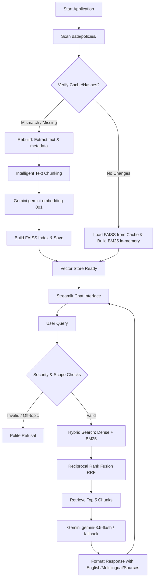

# Enterprise Policy Assistant

An AI-powered Enterprise Knowledge Retrieval Assistant designed to help employees search, query, and comprehend official company policies using Retrieval-Augmented Generation (RAG) powered by Streamlit, Google Gemini, and FAISS.

## Features

- **Departmental Document Management**: Policies are managed entirely from the backend within folders structured by departments (e.g., HR, IT, Security, Travel, Compliance).
- **Automated Cache Invalidation**: Automatic startup scan tracks file changes via MD5 hashes and sizes. The knowledge base is rebuilt automatically if any document is added, removed, or modified.
- **Hybrid Search Retrieval**: Combines FAISS-based dense semantic similarity (using Gemini `gemini-embedding-001`) and BM25-based keyword matching, combined using Reciprocal Rank Fusion (RRF) to retrieve the top 5 relevant policy chunks.
- **Grounded LLM Generation**: Uses Gemini `gemini-3.5-flash` (with fallback to `gemini-flash-lite-latest`) configured with strict system instructions, restricting it to only answer using provided document context and refusing off-topic or general knowledge queries.
- **Complete Reasoning Capability**: Configured with a large generation limit (`max_output_tokens=8192`) to fully accommodate Gemini's detailed reasoning thoughts, ensuring responses are never truncated mid-sentence.
- **Security & Scope Defenses**: Integrated keyword pre-filtering and guardrails to safeguard against prompt injection attempts (e.g., "Ignore previous instructions") and refuse unrelated domains (politics, entertainment, medical, programming).
- **Automatic Multilingual Query Support**: Detects the query language automatically. If the query is in a non-English language (e.g., Hindi, Tamil, Kannada, Marathi, etc.), it generates the response in both English and a translation of the same response in the input language, followed by the sources.
- **Natural Language Formatting**: Rounds non-critical decimals (like `2.08` days) to human-friendly whole numbers (e.g., "approximately 2 days per month") to match official policies without formatting clutter.
- **Conditional Sources Display**: Display citations (**Sources:**) only when information is retrieved or summarized from the policy documents. Simple greetings, acknowledgments, or out-of-scope replies will not display sources.
- **Conversational Memory**: Retains session history for natural multi-turn follow-up questions within the current chat, resetting securely when "New Chat" is clicked.
- **Premium Dribbble Light Theme**: Glassmorphic light styling, smooth lavender-indigo pastel gradients, clean white card chat message blocks, high contrast text, and high-visibility sidebar action controls.

## Demo Video

<video src="https://drive.google.com/uc?export=download&confirm=t&id=1YcnV5Ph1g6qCRG4vpj0rqB7C-Tiw7S1o" width="100%" controls></video>

---

## Architecture Diagram



---

## Folder Structure

```
d:/Projects/Enterprise/
├── app.py                      # Main Streamlit Application
├── config.py                   # Central Configurations & Prompts
├── requirements.txt            # Python Dependencies
├── .env.example                # Template Environment Variables
├── .gitignore                  # Git Ignore Specifications
├── README.md                   # Documentation
├── data/
│   └── policies/               # Department Folders with policy PDFs
│       ├── HR/
│       ├── IT/
│       ├── Security/
│       └── Travel/
├── vector_store/               # Index Cache & Scan Metadata
│   ├── index.faiss
│   ├── chunks.json
│   └── metadata.json
├── src/                        # Core Python Modules
│   ├── __init__.py
│   ├── chunking.py             # Smart Text Chunking logic
│   ├── document_loader.py      # PDF parsing and metadata tagging
│   ├── embeddings.py           # Gemini embeddings batch generator
│   ├── gemini.py               # Generation and Injection Defenses
│   ├── memory.py               # Conversation session manager
│   ├── startup.py              # Cache checking and scanning pipeline
│   ├── ui.py                   # UI styling and Streamlit elements
│   └── utils.py                # Logging and File MD5 hashing
└── scratch/
    └── generate_samples.py     # Script to generate sample policy PDFs
```

---

## Installation & Setup

### Prerequisites
- Python 3.10 to 3.12 (standard installation).
- A **Google Gemini API Key** from [Google AI Studio](https://aistudio.google.com/).

### Steps

1. **Clone or copy this repository** to your workspace.

2. **Create a Virtual Environment**:
   ```bash
   python -m venv venv
   ```

3. **Activate the Virtual Environment**:
   - **Windows PowerShell**:
     ```powershell
     .\venv\Scripts\Activate.ps1
     ```
   - **Windows CMD**:
     ```cmd
     .\venv\Scripts\activate.bat
     ```
   - **Linux / macOS**:
     ```bash
     source venv/bin/activate
     ```

4. **Install Dependencies**:
   ```bash
   pip install -r requirements.txt
   ```

5. **Configure Environment Variables**:
   Create a `.env` file in the root directory and add your API key:
   ```env
   GEMINI_API_KEY=AIzaSy...your_actual_key_here
   ```

6. **Generate Sample Policies**:
   Populate the policies folder with sample PDF documents to make the application immediately testable:
   ```bash
   python scratch/generate_samples.py
   ```

7. **Run the Streamlit App**:
   ```bash
   streamlit run app.py
   ```

---

## Usage & Multilingual Instructions

1. **Startup Check**:
   On launch, the application scans `data/policies/` recursively.
   - If starting for the first time, you will see a progress bar indicating: `"Reading company documents..."` -> `"Organizing policy information..."` -> `"Building enterprise knowledge base..."` -> `"Enterprise knowledge base is ready."`
   - Subsequent starts with unchanged files will load instantly from the cached index.

2. **Asking Questions (English & Multilingual)**:
   - Type queries in English (e.g., *"How many annual leave days do I get?"*).
   - Type queries in non-English languages (e.g. Hindi: *"मैं कितने दिनों की छुट्टी ले सकता/सकती हूँ?"* or Tamil: *"எனக்கு எத்தனை நாட்கள் விடுப்பு கிடைக்கும்?"*).
   - Non-English queries will return:
     1. The English response.
     2. The response translated into the query language.
     3. Sources at the bottom (without any confidence label clutter).

3. **Multi-turn Chat**:
   - Ask follow-up questions. The context of previous turns is preserved.

4. **Clearing History**:
   - Click **New Chat Session** in the sidebar to reset memory securely.

5. **Scope Verification**:
   - Entering off-topic or injection queries will be politely refused without showing sources.
